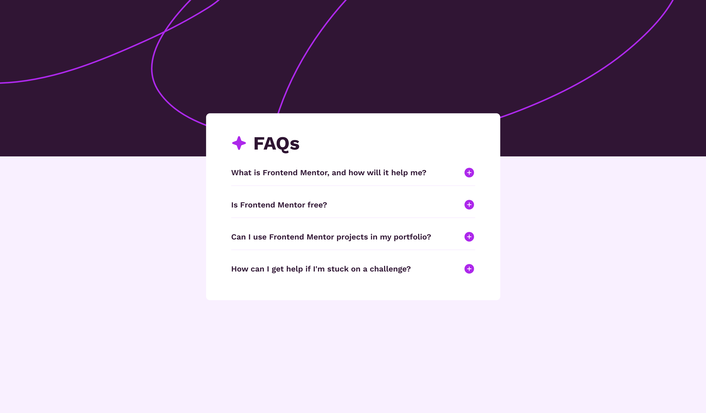
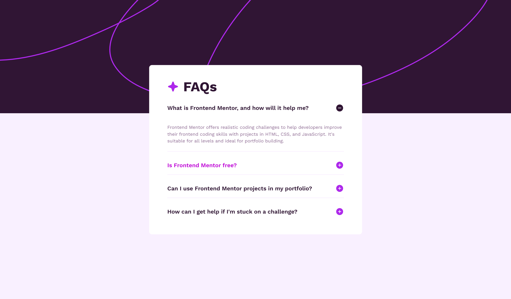

# Frontend Mentor - FAQ accordion solution

This is a solution to the [FAQ accordion challenge on Frontend Mentor](https://www.frontendmentor.io/challenges/faq-accordion-wyfFdeBwBz). Frontend Mentor challenges help you improve your coding skills by building realistic projects.

## Table of contents

- [Overview](#overview)
  - [The challenge](#the-challenge)
  - [Screenshot](#screenshot)
  - [Links](#links)
- [My process](#my-process)
  - [Built with](#built-with)
  - [What I learned](#what-i-learned)
  - [Continued development](#continued-development)
  - [Useful resources](#useful-resources)
- [Author](#author)
- [Acknowledgments](#acknowledgments)

## Overview

A FAQ accordion is an effective way to display frequently asked questions and answers on your website. It provides a user-friendly way for visitors to find information without overwhelming them with text.

### The challenge

Users should be able to:

- Hide/Show the answer to a question when the question is clicked
- Navigate the questions and hide/show answers using keyboard navigation alone
- View the optimal layout for the interface depending on their device's screen size
- See hover and focus states for all interactive elements on the page

### Screenshot

### Links

- Solution URL: [https://github.com/remainhumble/faq-accordion]
- Live Site URL: [https://remainhumble.github.io/faq-accordion/]

## My process

I started by studying the Frontend Mentor brief and the provided design files, then sketched a simple component breakdown to keep the implementation modular and accessible.
- Focused on semantic markup: each question is a button inside a list item to ensure correct semantics and assistive technology support.
- Keyboard navigation: supported Enter/Space to toggle, Arrow Up/Down to move focus between questions, and Home/End for quick navigation.
- Accessibility testing: validated with keyboard-only navigation.
- Cross-browser testing and responsiveness: checked on desktop, tablet, and mobile viewports; fixed spacing and overflow edge-cases.
- Deployment: published the site with GitHub Pages and added screenshots to the README file.

### Built with

- Semantic HTML5 markup
- CSS custom properties
- JavaScript

### What I learned

- Built semantic, accessible markup: questions implemented as buttons inside list items with proper ARIA (aria-expanded) so screen readers and assistive tech behave correctly.
- Keyboard interactions: implemented Enter/Space to toggle, Arrow Up/Down to move focus, and Home/End for quick navigation — ensuring full keyboard-only control.
- Focus management: learned to manage focus order and visible focus styles so keyboard users can reliably see and interact with the active item.
- Responsive layout & testing: adopted a mobile-first approach and fixed spacing/overflow edge cases through cross-device testing (mobile, tablet, desktop).
- Next steps: add unit/integration tests for keyboard interactions, extract reusable focus-management hooks, and improve accessibility by announcing state changes (e.g., polite live regions) where appropriate.

### Continued development

- Improve accessibility further
  - Add polite aria-live announcements for state changes and test with VoiceOver/NVDA.
  - Validate against WAI-ARIA Authoring Practices for accordions and run automated a11y audits.

- Testing and reliability
  - Add unit/integration tests for keyboard interactions (Jest + Testing Library).
  - Add end-to-end tests covering focus movement and edge cases (Playwright or Cypress).

- Focus management and keyboard UX
  - Extract reusable focus-management hooks/utilities (open/close, restore focus, trap when needed).
  - Ensure visible focus styles and support for prefers-reduced-motion.

- Componentization and documentation
  - Build a documented, themeable accordion component (Storybook stories, usage examples).
  - Publish clear API docs and examples for consumers.

- Performance and animation
  - Prefer CSS-driven animations, avoid layout thrashing; optimize for smooth transitions.
  - Respect reduced-motion preferences and test animation impact on low-end devices.

- Tooling and type safety
  - Adopt TypeScript for safer refactors.
  - Integrate linting, accessibility checks, and CI to catch regressions early.

- Cross-browser & responsive polish
  - Test interactive behavior across browsers and mobile keyboards; handle overflow/edge cases.
  - Improve visual polish and spacing for multiple breakpoints.

- Future accessibility enhancements
  - Consider announcing state changes with live regions, ARIA updates, and better screen-reader messaging.
  - Explore automated accessibility regression testing as part of CI.

### Useful resources

- [FAQ accordion using HTML, CSS, JavaScript](https://www.youtube.com/watch?v=4qnWreynXLU) - Learnt and repeated after most of the work from this video, however I definitely did have to work on the appearance and behaviour myself to closely match the designs downloaded from Front End Mentor site.
- [Why web accessibility matters](https://www.frontendmentor.io/learning-paths/introduction-to-web-accessibility-mXu-9PHVsd/article/6647781a20fb35b1b61abb4d/read) - A concise overview of accessibility principles and practical guidance for making interactive components (like accordions) keyboard- and screen-reader-friendly, plus links to further learning.

## Author

- Frontend Mentor - [@remainhumble](https://www.frontendmentor.io/profile/remainhumble)
- X(formerly Twitter) - [@thiflan120699](https://x.com/thiflan120699)
